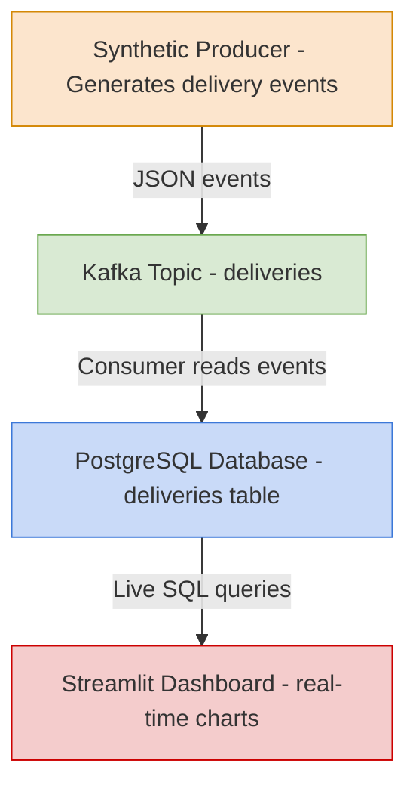

# 🚚 Real-Time Food Delivery Streaming Dashboard

A full real-time data engineering pipeline using Kafka, PostgreSQL, Python, and Streamlit

## Project Overview

This project implements a complete real-time data streaming system that simulates a DoorDash/UberEats–style food delivery platform.
Synthetic food delivery events are generated in real time, streamed through Apache Kafka, stored in PostgreSQL, and visualized live in a Streamlit dashboard.

This repository was built demonstrating:

- Real-time event streaming
- Kafka producers & consumers
- Database integration
- Live dashboards
- Domain creativity (Food Delivery)
- Custom metrics & charts

## System Architecture



## Why Food Delivery? (Domain Justification)

Instead of reusing the base e-commerce example, this project introduces a completely new domain with meaningful attributes that reflect real-world delivery platforms.

New fields include:
- `restaurant`
- `cuisine`
- `region`
- `delivery_distance_km`
- `delivery_time_estimate_min`
- `driver_rating`
- `surge_multiplier` (NEW — captures dynamic pricing)

These attributes allow richer analysis and more realistic metrics than simple e-commerce transactions.

## ✨ Key Features

1. Real-Time Synthetic Data

    The producer continuously generates randomized food delivery events, including:

    - Driver ratings
    - Surge multipliers
    - Travel distances
    - Estimated delivery times
    - Cuisine & region metadata
2. Stream Processing with Kafka

    - Kafka topic: deliveries

    - Producer sends JSON events

    - Consumer reads them continuously and inserts into PostgreSQL

3. PostgreSQL Storage
    - Automatic table creation
    - Schema designed for analytical queries
    - Conflict-safe inserts

4. Live Streamlit Dashboard

    Auto-updating dashboard includes:
    - KPIs
        - Total Deliveries
        - Avg Delivery Time
        - Avg Surge Multiplier
        - Avg Driver Rating

    - Visualizations
        - Horizontal Bar: Deliveries by Cuisine
        - Line Chart: Avg Delivery Time by Region
        - Boxplot: Surge Multiplier Distribution
        - Density Plot: Driver Rating Distribution

    - Filters
        - Auto-refresh interval
        - Cuisine filter
        - Region filter
        - Adjustable number of records

## Technologies Used
| Component           | Technology                                         |
| ------------------- | -------------------------------------------------- |
| Real-time messaging | **Apache Kafka**                                   |
| Data generator      | Python + Faker                                     |
| Storage             | **PostgreSQL 15**                                  |
| Visualization       | **Streamlit**                                      |
| Deployment          | Docker Compose                                     |
| Python Libraries    | kafka-python, psycopg2, pandas, plotly, sqlalchemy |


## Project Structure
```
kafka_realtime_pipeline/
│── docker-compose.yml
│── producer.py
│── consumer.py
│── dashboard.py
│── requirements.txt
└── README.md
```


## How to Run the Project
1. Start Docker Services
```
docker-compose up -d
```


2. Create Kafka Topic
```
docker exec -it kafka kafka-topics --create \
  --topic orders \
  --bootstrap-server localhost:9092 \
  --partitions 1 \
  --replication-factor 1

# Verify topic was created
docker exec -it kafka kafka-topics --list --bootstrap-server localhost:9092
```

3. Start Consumer
```
python consumer.py
```


4. Start Producer
```
python producer.py
```


5. Run Dashboard
```
streamlit run dashboard.py
```

Open the UI:
👉 http://localhost:8501/

## Example Event
```json
{
  "delivery_id": "91dfb872",
  "restaurant": "Sushi House",
  "cuisine": "Sushi",
  "region": "Downtown",
  "delivery_distance_km": 4.2,
  "delivery_time_estimate_min": 34,
  "driver_rating": 4.7,
  "surge_multiplier": 1.4,
  "timestamp": "2025-11-17T11:45:22.389Z"
}
```

## Screenshots and recording
### Dashboard screenshot


### Live Real-Time Dashboard Recording
